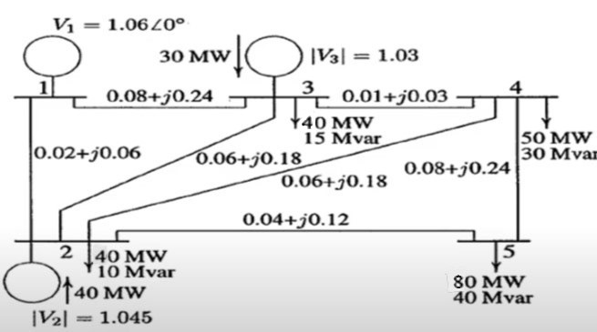

# 5-Bus Load Flow Analysis using MATLAB and PowerWorld

Load-flow analysis of a 5-bus power system using **MATLAB** and **PowerWorld Simulator**, including Ybus formation, Gauss-Seidel power-flow analysis, bus-voltage evaluation, transmission-loss calculation, and a line-impedance sensitivity study.

**Course:** EEE 4401 — Power System I  
**Project Type:** Complex Engineering Problem (CEP)  
**Department:** Electrical and Electronic Engineering  
**Institution:** Islamic University of Technology (IUT)

---

## Overview

This project analyzes the steady-state operating condition of a **5-bus power system** using MATLAB and PowerWorld Simulator.

The project includes:

- Selection of a suitable 5-bus power system
- Formation of the bus admittance matrix (**Ybus**)
- Representation of Ybus in rectangular and polar forms
- Load-flow analysis using the **Gauss-Seidel method**
- Calculation of bus voltages
- Calculation of transmission-line currents and power flows
- Active and reactive power-loss calculation
- Power-system modeling in **PowerWorld Simulator**
- Comparison and validation of simulation results
- Investigation of the effect of transmission-line impedance on system losses

---

## System Configuration

The selected network contains:

- **5 buses**
- **1 slack bus**
- **2 generator/PV buses**
- **2 load/PQ buses**
- **7 transmission lines**

The total system demand is:

- **Real Power Demand:** 210 MW
- **Reactive Power Demand:** 95 MVAr

These values satisfy the specified CEP requirement of:

- 200 MW ≤ P ≤ 250 MW
- 80 MVAr ≤ Q ≤ 100 MVAr

### 5-Bus Network

<p align="center">
  
</p>

---

## Bus Data

| Bus | Type | Voltage | Generation | Load |
|---|---|---:|---:|---:|
| Bus 1 | Slack | 1.060 ∠ 0° p.u. | Determined by load flow | — |
| Bus 2 | Generator (PV) | 1.045 p.u. | 40 MW | 40 MW, 10 MVAr |
| Bus 3 | Generator (PV) | 1.030 p.u. | 30 MW | 40 MW, 15 MVAr |
| Bus 4 | Load (PQ) | Calculated | — | 50 MW, 30 MVAr |
| Bus 5 | Load (PQ) | Calculated | — | 80 MW, 40 MVAr |

---

## Transmission-Line Data

The transmission network is represented using per-unit line impedances.

| From Bus | To Bus | Resistance R (p.u.) | Reactance X (p.u.) |
|---:|---:|---:|---:|
| 1 | 2 | 0.02 | 0.06 |
| 1 | 3 | 0.08 | 0.24 |
| 2 | 3 | 0.06 | 0.18 |
| 2 | 4 | 0.06 | 0.18 |
| 2 | 5 | 0.04 | 0.12 |
| 3 | 4 | 0.01 | 0.03 |
| 4 | 5 | 0.08 | 0.24 |

---

## Methodology

### 1. Ybus Formation

The transmission-line impedance data are used to determine the corresponding line admittances.

The bus admittance matrix is then constructed from the self and mutual admittances of the network.

The project evaluates Ybus in:

- Rectangular form
- Polar form

---

### 2. Gauss-Seidel Load Flow

The main MATLAB implementation applies the **Gauss-Seidel iterative method** to determine the unknown bus voltages.

The buses are modeled according to their operating types:

- **Bus 1:** Slack bus
- **Bus 2:** PV bus
- **Bus 3:** PV bus
- **Bus 4:** PQ bus
- **Bus 5:** PQ bus

After the bus voltages are determined, the program calculates:

1. Transmission-line currents
2. Complex power flow through each line
3. Active power losses
4. Reactive power losses

A base power of **100 MVA** is used when converting the per-unit power quantities to MW and MVAr.

---

## MATLAB Results

The corrected Gauss-Seidel implementation produced the following bus-voltage magnitudes:

| Bus | Voltage Magnitude |
|---|---:|
| Bus 1 | 1.0600 p.u. |
| Bus 2 | 1.0450 p.u. |
| Bus 3 | 1.0300 p.u. |
| Bus 4 | 1.0163 p.u. |
| Bus 5 | 0.9796 p.u. |

### Transmission-Line Losses

| Line | Complex Power Loss |
|---|---:|
| 1–2 | 1.4634 + j4.3903 MVA |
| 1–3 | 0.7476 + j2.2429 MVA |
| 2–3 | 0.1012 + j0.3035 MVA |
| 2–4 | 0.2717 + j0.8151 MVA |
| 2–5 | 1.9930 + j5.9790 MVA |
| 3–4 | 0.2676 + j0.8028 MVA |
| 4–5 | 0.3000 + j0.9000 MVA |

### Total Network Loss

**Active Power Loss**

```text
5.1446 MW
